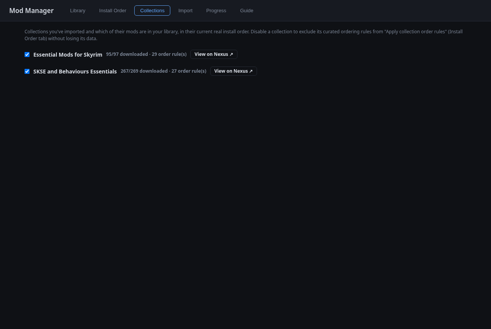
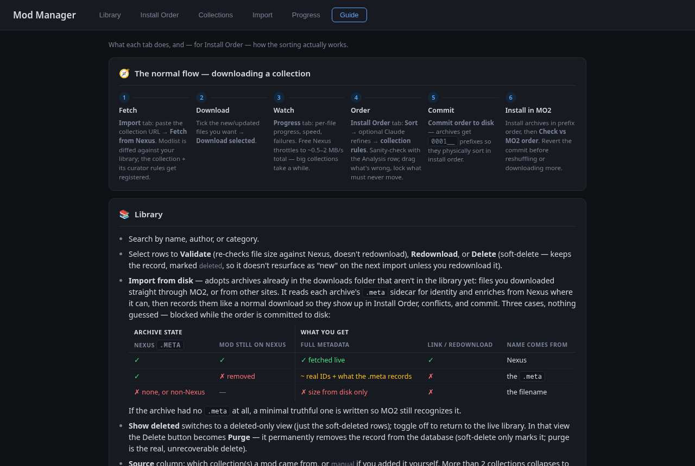

# Mod Manager

Downloads Skyrim SE mods from Nexus collections and tracks them in a local
SQLite library. Works with a free Nexus account by generating download links
through your own logged-in browser session.

## Setup

- System Chromium (`pacman -S chromium`) — start with `./browser.sh`
  (dedicated profile + CDP on port 9223) and log into nexusmods.com once
- `python -m venv .venv && .venv/bin/pip install -r requirements.txt`
- Node 20+: `cd frontend && npm install && npm run build`

## Web app

```
cd frontend && npm run build   # once, and after frontend changes
.venv/bin/python webapp.py     # http://127.0.0.1:7788/
```

Frontend development:

```
cd frontend
npm run dev     # Vite dev server on :5173, proxies /api to the backend
npm run check   # typecheck + unit tests + build
npm run e2e     # Playwright suite (own backend on 7799, DB copy)
```

## Tabs

- **Library** — browse/search `mods.db`; validate, redownload, or delete
  files. `Import from disk` adopts archives already in the downloads folder
  via their `.meta` sidecars. `Show deleted` switches to a deleted-only view
  where Delete becomes `Purge` (permanent).

  

- **Install Order** — MO2 left-panel install order (which mod overwrites
  which — not plugin load order), persisted in `mods.db` so order, locks and
  flags survive restarts. **Ordering** tools change the order:
  `Sort (heuristic)` classifies mods into the STEP SkyrimSE 2.3 guide's 20
  groups; `Refine with Claude` / `Refine uncertain` send mods (plus real
  scanned file conflicts) to Claude for corrections, with an editable prompt
  and a safety valve that rejects replies reshuffling too much; `Apply
  collection order rules` enforces curator before/after rules from imported
  collections. **Analysis** tools are read-only: `Scan archives` finds real
  file-path overlaps (via `7z`), `Sync requirements` flags missing Nexus
  dependencies, `Check for drift` flags manually-moved mods, `Check vs MO2
  order` compares against what MO2 actually has installed. Drag rows,
  multi-select for bulk lock/move, lock (🔒) pins a mod against every
  sort pass. Priority when signals disagree: locked > manual move >
  collection rule > Claude > heuristic.

  

- **Collections** — imported collections and which of their mods are in the
  library. Disable one to exclude its ordering rules without losing data.

  

- **Import** — paste a collection URL, mod page URL, or `modlist.json`;
  diffed against the library into new / updated / unchanged.

  

- **Progress** — live download dashboard.

  

- **Guide** — in-app reference for every tab and how sorting works.

  

## Sorter prompt

"Refine with Claude" uses the default prompt built into
`modman/llm_refine.py` (STEP 2.3 group scheme, corrections-only reply
format, UNCERTAIN/CONFLICT/DUPLICATE flags). It's editable inline in the
Install Order tab — stored in the `meta` table, empty save resets to
default. Locked mods are excluded and spliced back afterwards; a reply
that tries to "correct" more than 40% of the mods is rejected outright.

## CLI

```
.venv/bin/python cli.py https://www.nexusmods.com/games/skyrimspecialedition/collections/<slug>
.venv/bin/python cli.py modlist.json --include-unchanged
```

## Layout

```
modman/
  config.py         game/paths/constants
  db.py             sqlite library (mods = files, mod_sort = install order)
  nexus.py          GraphQL fetch, CDP link generation, file transfer
  engine.py         diff + download pipeline, progress state
  mo2.py            MO2 .meta interop (installed state)
  mo2_order.py      compares the list vs MO2's real installed order
  importlocal.py    adopts on-disk archives into the library
  buckets.py        STEP 2.3 groups + heuristic classifier
  order_store.py    mod_sort CRUD, heuristic sort, locks, moves
  llm_refine.py     claude -p refine passes
  conflicts.py      real archive file-path overlap scan (7z)
  requirements.py   Nexus "requires" edges, missing-dependency check
  collection_rules.py  curator rules from a collection manifest
  precedence.py     applies collection_rules as final adjustment
webapp.py     FastAPI server + JSON API
cli.py        command-line downloader
browser.sh    launches the dedicated Chromium (profile + debug port)
frontend/     React + TS (Vite; unit tests in src/, Playwright e2e in e2e/)
```

Files land in `/games/modding/downloads/`. Downloads resume on re-run;
completed files are skipped via the DB diff.
