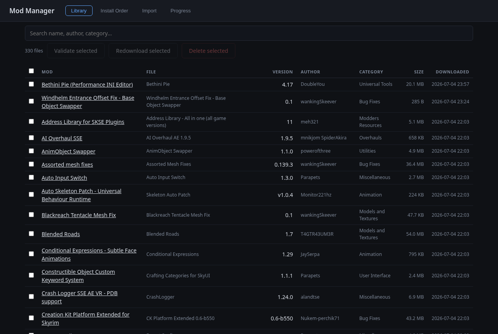
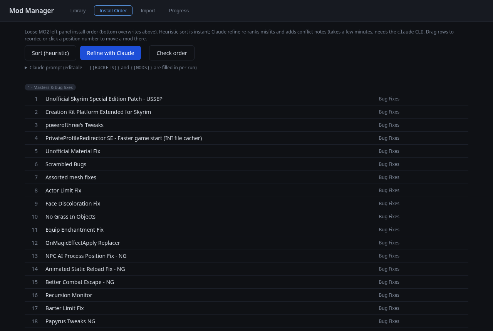
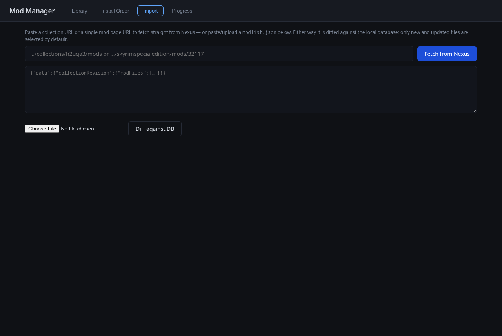
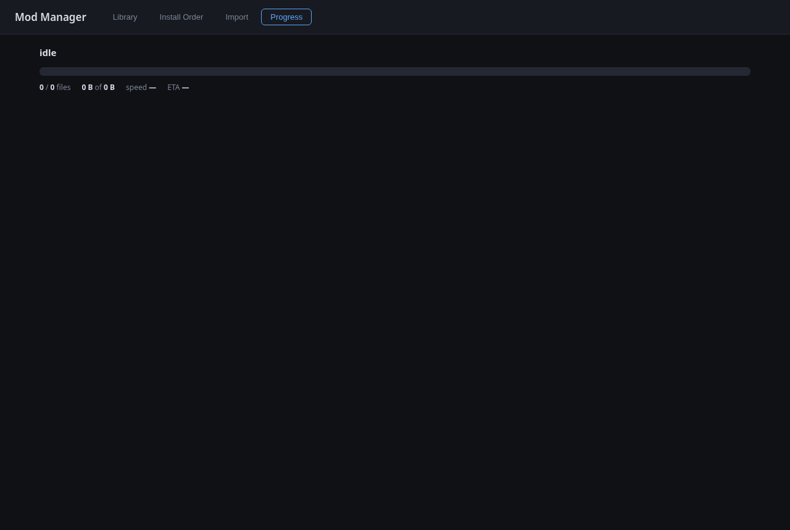

# Mod Manager

Downloads Skyrim SE mods from Nexus collections and tracks them in a local
SQLite library. Works with a free Nexus account by generating download links
through your own logged-in browser session.

## Requirements

- System Chromium (`pacman -S chromium`) — start it with `./browser.sh`
  (dedicated profile + CDP on port 9223) and log into nexusmods.com once
- `python -m venv .venv && .venv/bin/pip install -r requirements.txt`

## Web app

```
.venv/bin/python webapp.py   # http://127.0.0.1:7788/
```

- **Library** — browse/search everything in `mods.db`; validate, redownload,
  or delete selected files

  

- **Install Order** — loose MO2 left-panel install order for the library.
  Instant heuristic sort (Nexus category + name keywords → the STEP 2.3
  guide's 20 groups, Extenders → Post-Processing), plus
  an optional "Refine with Claude" pass (`claude -p`, uses your Claude Code
  login) that re-ranks misfits, tags patches and lists conflicts. Drag rows
  to reorder manually; click a position number to jump a mod there. Mods MO2
  reports as installed are badged.

  

- **Import** — paste a collection URL or a single mod page URL (fetched via
  Nexus GraphQL), or paste/upload a `modlist.json`; diffed against the
  library into new / updated / unchanged

  

- **Progress** — live download dashboard

  

## Sorter prompt

The "Refine with Claude" pass sends the prompt below (the built-in default in
`modman/sorter.py`, so a fresh installation works out of the box). It is
editable in the Install Order tab — a custom version is stored in the `meta`
table and an empty save resets to this default. `{{BUCKETS}}` is replaced with
the numbered group list and `{{MODS}}` with one `mod_id|name|nexus
category|heuristic bucket` line per mod.

```
You are a Skyrim SE mod install order sorter for the MO2 left panel
(top to bottom, bottom = highest priority / overwrites above).

Buckets, in install order (the STEP SkyrimSE 2.3 guide's MO2 separators):
{{BUCKETS}}

Rules: a patch always goes below what it patches; more specific mods below
general ones; primary function decides multi-category mods. STEP conventions:
USSEP and base mesh/lighting overhauls (SMIM, ELFX, Majestic Mountains) are
Foundation; Nemesis/DynDOLOD/LOD tools are Utilities; generic bug-fix mods go
in Fixes, not Foundation; ENB/particle-light mods are Post-Processing, below
Patches.

Input lines below: mod_id|mod name|nexus category|heuristic bucket guess.
The guess may be wrong — fix misfits.

Reply with ONLY a JSON object, no prose, no code fences:
{"order": [{"id": <mod_id>, "b": <bucket 1-20>, "f": ["PATCH"|"UNCERTAIN"|"CONFLICT: <reason>"]}, ...],
 "conflicts": ["<mod A> vs <mod B>: <which should win and why>", ...]}
"order" must contain every input mod exactly once, in full install order.
Omit "f" when a mod has no flags.

Mods:
{{MODS}}
```

## CLI

```
.venv/bin/python cli.py https://www.nexusmods.com/games/skyrimspecialedition/collections/<slug>
.venv/bin/python cli.py modlist.json --include-unchanged
```

## Layout

```
modman/
  config.py   game/paths/constants
  db.py       sqlite library (mods.db)
  nexus.py    GraphQL collection fetch, CDP link generation, file transfer
  engine.py   diff + download pipeline, progress state
  sorter.py   install-order sort (heuristic buckets + claude -p refine)
webapp.py     FastAPI server + JSON API
cli.py        command-line downloader
browser.sh    launches the dedicated Chromium (profile + debug port)
web/          frontend (single page)
```

Files land in `/games/modding/downloads/`. Downloads resume on re-run;
completed files are skipped via the DB diff.
